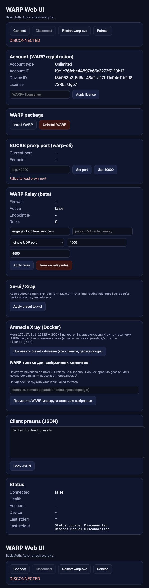
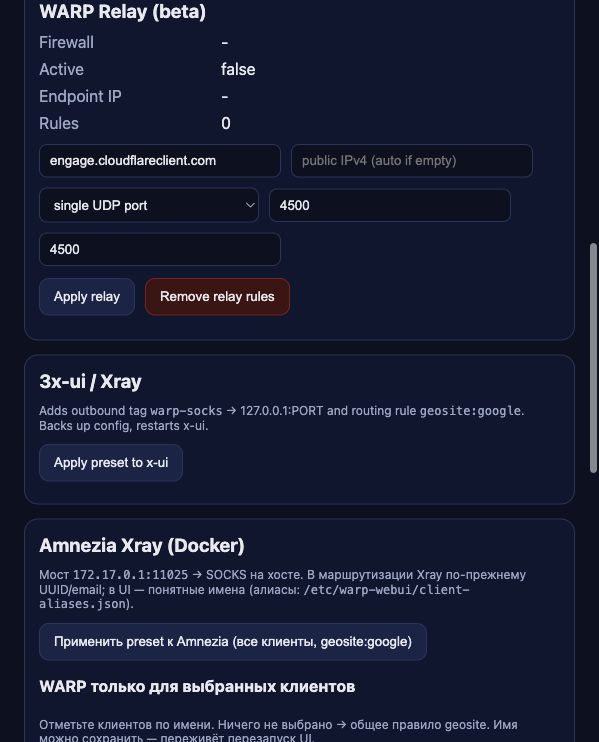

# WARP Web UI

Веб-панель для управления **Cloudflare WARP** на Linux: подключение и отключение туннеля, активация WARP+, настройка SOCKS-прокси, готовые пресеты для **3x-ui**/**Amnezia Xray** и beta-модуль **WARP Relay**.





Документация на английском (кратко): [README.en.md](README.en.md).

## Возможности

- **Управление WARP**: подключение, отключение, перезапуск `warp-svc`, просмотр статуса и логов
- **Аккаунт**: информация о регистрации, применение лицензионного ключа WARP+
- **Установка и удаление** пакета `cloudflare-warp` прямо из браузера (репозиторий Cloudflare для Debian/Ubuntu)
- **SOCKS-прокси**: смена порта `warp-cli proxy` (часто `40000` или `1024`)
- **Маршрутизация WARP**: списки доменов/IP, JSON-подсказка для Xray, включение/выключение правил Amnezia/Xray, тест внешнего IP напрямую и через WARP
- **WARP Relay beta**: UDP relay через `nftables`/`iptables` на выбранный WARP/WireGuard endpoint, single-port или Cloudflare multiport, DNS/ping probe endpoint-ов
- **Пресет 3x-ui**: outbound `warp-socks` → `127.0.0.1:ПОРТ` и правило маршрутизации `geosite:google`
- **Пресет Amnezia**: мост Docker `172.17.0.1:11025` → SOCKS на хосте, маршрутизация WARP для выбранных клиентов с понятными именами

## Требования

- Linux (рекомендуется Debian/Ubuntu)
- `python3` — только стандартная библиотека, без pip
- `systemd`
- `nftables` или `iptables` для WARP Relay beta
- По желанию: пакет `cloudflare-warp` (можно поставить из UI или скриптом `scripts/warp-install-cf.sh`)
- Для интеграций: `docker`, `socat`, панель **3x-ui** и/или **Amnezia**

## Быстрый старт

### Установка одной командой

```bash
curl -fsSL https://raw.githubusercontent.com/andrey271192/WARP-Web-UI/main/install.sh | sudo bash
```

Beta-репозиторий с WARP Relay:

```bash
curl -fsSL https://raw.githubusercontent.com/andrey271192/WARP-Web-UI-Relay-Beta/main/install.sh | sudo bash
```

Установщик **задаёт вопросы** (можно нажать Enter для значения по умолчанию):

| Вопрос | По умолчанию | Зачем это нужно |
|--------|--------------|-----------------|
| Порт SOCKS-прокси | `40000` | Локальный порт `warp-cli` в режиме proxy; для официального `cloudflare-warp` часто берут `1024` |
| Порт веб-панели | `3030` | HTTP-порт панели; при необходимости откройте его в firewall |
| Логин администратора | `warpadmin` | HTTP Basic Auth |
| Пароль администратора | *(обязательно, не короче 8 символов)* | Сохраняется в `/etc/default/warp-webui` с правами `chmod 600` |

### Установка из клона репозитория

```bash
git clone https://github.com/andrey271192/WARP-Web-UI.git
cd WARP-Web-UI
sudo bash install.sh
```

Откройте в браузере `http://АДРЕС_СЕРВЕРА:3030/` (подставьте выбранный порт). Войдите с логином и паролем, которые указали при установке.

Если WARP ещё не установлен — нажмите **Установить WARP** в интерфейсе (или выполните `scripts/warp-install-cf.sh`, задав `WARP_PROXY_PORT`).

### Удаление

```bash
curl -fsSL https://raw.githubusercontent.com/andrey271192/WARP-Web-UI/main/uninstall.sh | sudo bash
```

Beta-репозиторий:

```bash
curl -fsSL https://raw.githubusercontent.com/andrey271192/WARP-Web-UI-Relay-Beta/main/uninstall.sh | sudo bash
```

Или из каталога клона: `sudo bash uninstall.sh` — останавливает сервис, по запросу удаляет файлы приложения, конфигурацию и при желании пакет `cloudflare-warp`.

## Структура репозитория

```
app.py                          # Веб-интерфейс и API (Python http.server)
scripts/warp-install-cf.sh      # Установка cloudflare-warp из apt Cloudflare
scripts/warp-uninstall-cf.sh    # Удаление пакета cloudflare-warp
systemd/warp-webui.service      # Шаблон unit для systemd
install.sh / uninstall.sh       # Установка и снятие «в одну команду»
.env.example                    # Справочник переменных окружения
```

После установки файлы лежат в `/opt/warp-webui/`, настройки — в `/etc/default/warp-webui`.

## Настройка

Подробности — в [`.env.example`](.env.example). Основные переменные:

- `WARP_WEBUI_USER`, `WARP_WEBUI_PASS` — Basic Auth для панели
- `WARP_WEBUI_PORT` — HTTP-порт (по умолчанию `3030`)
- `WARP_PROXY_PORT` — порт SOCKS при установке и при установке WARP из UI
- `WARP_PUBLIC_HOST` — публичный IP или hostname для подсказок в пресетах клиентов

Понятные имена клиентов Amnezia: `/etc/warp-webui/client-aliases.json`.

### Маршрутизация WARP

В панели есть блок **Маршрутизация WARP**. Он нужен, когда не хочется отправлять весь трафик через WARP, а только выбранные сайты или IP-сети.

Что можно указать:

- домены: `openai.com`, `chatgpt.com`, `youtube.com`;
- правила Xray: `geosite:google`, `geosite:youtube`, `domain:example.com`, `full:example.com`, `regexp:...`;
- IP и сети: `1.1.1.1`, `8.8.8.0/24`;
- geoip-правила Xray: `geoip:private`, `geoip:cn`.

Кнопки:

- **Сохранить список** — записывает настройки в `/etc/warp-webui/warp-routes.json`, но не трогает Xray.
- **Включить в Amnezia/Xray** — добавляет outbound `warp-socks`, создаёт backup `server.json`, добавляет глобальное routing-правило и перезапускает контейнер Amnezia.
- **Выключить правила** — убирает глобальные правила `warp-socks` из Amnezia/Xray, список остаётся сохранённым.
- **JSON для Xray** — показывает готовые куски `outbound` и `routing_rule` для ручной настройки 3x-ui/Amnezia.
- **Тест IP** — показывает внешний IP сервера напрямую и внешний IP через `127.0.0.1:WARP_PROXY_PORT`.

Важно: обычный Cloudflare WARP не даёт выбрать конкретную страну или конкретный exit IP. Эта функция выбирает, **какие домены/IP пойдут через WARP**, а не страну выхода. Если нужен гарантированный регион, нужен отдельный VPN/proxy с выбранной страной или корпоративный Cloudflare egress.

### Смена логина и пароля

В панели есть блок **Доступ к панели**:

1. Введите новый логин. Разрешены латиница, цифры и символы `._@-`.
2. Введите новый пароль, минимум 8 символов. Если поле пароля оставить пустым, изменится только логин.
3. Нажмите **Сохранить доступ**.
4. Панель сохранит настройки в `/etc/default/warp-webui`, создаст backup в `/var/backups/warp-webui/` и перезапустит сервис.
5. После перезапуска браузер попросит войти заново уже с новым логином и паролем.

Важно: текущая версия использует HTTP Basic Auth. Для открытого сервера поставьте HTTPS через nginx/Caddy и ограничьте доступ firewall-ом.

## Интеграция с 3x-ui (по желанию)

1. Установите и подключите WARP, включите режим proxy и задайте порт SOCKS (в панели или при `install.sh`).
2. В веб-панели используйте действие пресета **3x-ui** — будет предложен outbound на `127.0.0.1:ПОРТ` и правило для `geosite:google`.
3. Убедитесь, что конфиг x-ui указывает на тот же порт, что и `WARP_PROXY_PORT`.

Требуется установленная панель x-ui и доступ к её `config.json` (путь можно переопределить в `.env`).

## Интеграция с Amnezia (по желанию)

1. На хосте с Docker поднимите SOCKS WARP и при необходимости мост `socat` (панель может создать unit `warp-socks-bridge`).
2. В панели примените пресет **Amnezia** — маршрутизация через `172.17.0.1:11025` к SOCKS на хосте.
3. Назначайте WARP только нужным клиентам; имена удобно править в `client-aliases.json`.

Нужны `docker`, контейнер Amnezia Xray и переменные `AMNEZIA_*` при нестандартных путях — см. `.env.example`.

## WARP Relay beta

`openwarpkit/warp-relay` взят как идея и встроен без запуска внешнего интерактивного скрипта. Панель сама управляет только своими firewall rules с тегом `WR_WEBUI_RELAY`.

Что можно делать из UI:

- выбрать endpoint: `engage.cloudflareclient.com`, IPv4 или свой hostname;
- выбрать source IP сервера или оставить автоопределение;
- включить режим одного UDP-порта, обычно `4500 -> 4500`;
- включить Cloudflare multiport mode;
- проверить endpoint через DNS/ping probe и подставить лучший IP в поле endpoint;
- удалить только managed relay rules.

Важно: relay не гарантирует конкретный Cloudflare exit IP или страну. Он меняет WARP/WireGuard endpoint, через который клиент подключается. Для "желаемой точки" сейчас используйте ручной endpoint/IP или кнопку **Найти endpoint**.

## Безопасность

- **Только HTTP Basic Auth** — учётные данные передаются с каждым запросом. В продакшене ставьте **HTTPS** (обратный прокси: nginx, Caddy + TLS).
- **Firewall**: открывайте порт панели только для доверенных IP, например: `ufw allow from ДОВЕРЕННЫЙ_IP to any port 3030`.
- **Права root**: панель работает от root, чтобы управлять `warp-cli`, systemd и Docker. Не выставляйте её в открытый интернет без защиты.
- **Секреты**: не коммитьте `/etc/default/warp-webui` в git. После установки смените пароль администратора.
- Ключи WARP+ вводятся в UI и передаются в `warp-cli`; в репозитории они не хранятся.

## API (требуется авторизация)

| Метод | Путь | Описание |
|-------|------|----------|
| GET | `/` | HTML-интерфейс |
| GET | `/status`, `/registration`, `/proxy`, `/logs` | Статус и диагностика |
| GET | `/auth-config` | Текущий логин панели и путь к env-файлу |
| GET | `/relay` | Статус WARP Relay beta |
| GET | `/warp-routes` | Список доменов/IP для маршрутизации через WARP |
| POST | `/connect`, `/disconnect`, `/restart` | Управление WARP |
| POST | `/warp-install`, `/warp-uninstall` | Установка/удаление пакета |
| POST | `/auth-config` | Смена логина/пароля веб-панели |
| POST | `/relay-apply`, `/relay-remove`, `/relay-probe` | Применить/удалить WARP Relay rules, проверить endpoint |
| POST | `/warp-routes-save`, `/warp-routes-enable`, `/warp-routes-disable`, `/warp-routes-test`, `/warp-routes-preview` | Сохранить/применить/выключить маршруты WARP, проверить внешний IP, показать JSON для Xray |
| POST | `/proxy-port`, `/license` | Порт SOCKS, ключ WARP+ |
| POST | `/xui-preset`, `/amnezia-preset`, `/amnezia-routing` | Пресеты интеграций |

## Лицензия

MIT — см. [LICENSE](LICENSE).
